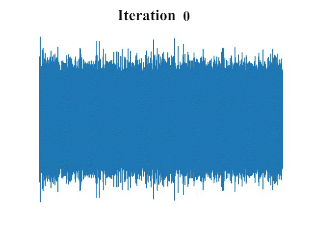

# FastDiff: A Fast Conditional Diffusion Model for High-Quality Speech Synthesis

<div align=center>  </div>


#### Rongjie Huang, Max W. Y. Lam, Jun Wang, Dan Su, Dong Yu, Yi Ren, Zhou Zhao

PyTorch Implementation of [FastDiff (IJCAI'22)](https://arxiv.org/abs/2204.09934): a conditional diffusion probabilistic model capable of generating high fidelity speech efficiently.

[](https://arxiv.org/abs/2204.09934)
[](https://github.com/Rongjiehuang/FastDiff)

[](https://huggingface.co/spaces/Rongjiehuang/ProDiff)

We provide our implementation and pretrained models as open source in this repository.

Visit our [demo page](https://fastdiff.github.io/) for audio samples.

Our follow-up work might also interest you: [ProDiff (ACM Multimedia'22)](https://arxiv.org/abs/2207.06389) on [GitHub](https://github.com/Rongjiehuang/ProDiff)

## News
- April.22, 2021: **FastDiff** accepted by IJCAI 2022.
- June.21, 2022: The LJSpeech checkpoint and demo code are provided.
- August.12, 2022: The VCTK/LibriTTS checkpoints are provided.
- August.25, 2022: **FastDiff (tacotron)** is provided.
- September, 2022: We release follow-up work [ProDiff (ACM Multimedia'22)](https://arxiv.org/abs/2207.06389) on [GitHub](https://github.com/Rongjiehuang/ProDiff), where we futher optimized the speed-and-quality trade-off.

# Quick Started
We provide an example of how you can generate high-fidelity samples using FastDiff.

To try on your own dataset, simply clone this repo in your local machine provided with NVIDIA GPU + CUDA cuDNN and follow the below intructions.

## Support Datasets and Pretrained Models

You can also use pretrained models we provide [here](https://zjueducn-my.sharepoint.com/:f:/g/personal/rongjiehuang_zju_edu_cn/Epia7La6O7FHsKPTHZXZpoMBF7PoDcjWeKgC-7jtpVkCOQ?e=b8vPiA).
Details of each folder are as in follows:

| Dataset            | Config                                           | 
|--------------------|--------------------------------------------------|
| LJSpeech           | `modules/FastDiff/config/FastDiff.yaml`          | 
| LibriTTS           | `modules/FastDiff/config/FastDiff_libritts.yaml` | 
| VCTK               | `modules/FastDiff/config/FastDiff_vctk.yaml`     |    
| LJSpeech(Tacotron) | `modules/FastDiff/config/FastDiff_tacotron.yaml` |    

More supported datasets are coming soon.

Put the checkpoints in `checkpoints/$your_experiment_name/model_ckpt_steps_*.ckpt`

## Dependencies
See requirements in `requirement.txt`:
- [pytorch](https://github.com/pytorch/pytorch)
- [librosa](https://github.com/librosa/librosa)
- [NATSpeech](https://github.com/NATSpeech/NATSpeech)

## Multi-GPU
By default, this implementation uses as many GPUs in parallel as returned by `torch.cuda.device_count()`. 
You can specify which GPUs to use by setting the `CUDA_DEVICES_AVAILABLE` environment variable before running the training module.

## Inference for text-to-speech synthesis

### Using ProDiff
We provide a more efficient and stable pipeline in [](https://huggingface.co/spaces/Rongjiehuang/ProDiff) and [GitHub](https://github.com/Rongjiehuang/ProDiff)

### Using Tacotron
Download LJSpeech checkpoint for neural vocoding of tacotron output [here](https://zjueducn-my.sharepoint.com/:f:/g/personal/rongjiehuang_zju_edu_cn/Epia7La6O7FHsKPTHZXZpoMBF7PoDcjWeKgC-7jtpVkCOQ?e=b8vPiA).
We provide a demo in `egs/demo_tacotron.ipynb`. 

### Using Portaspeech, DiffSpeech, FastSpeech 2

1. Download LJSpeech checkpoint and put it in `checkpoint/FastDiff/model_ckpt_steps_*.ckpt `
2. Specify the input `$text`, and an int-type index `$model_index` to choose the TTS model. `0`(Portaspeech, Ren et al), `1`(FastSpeech 2, Ren et al), or `2`(DiffSpeech, Liu et al).
3. Set `N` for reverse sampling, which is a trade off between quality and speed. 
4. Run the following command.
```bash
CUDA_VISIBLE_DEVICES=$GPU python egs/demo_tts.py --N $N --text $text --model $model_index 
```
Generated wav files are saved in `checkpoints/FastDiff/` by default.<br>
Note: For better quality, it's recommended to finetune the FastDiff model.

## Inference from wav file
1. Make `wavs` directory and copy wav files into the directory.
2. Set `N` for reverse sampling, which is a trade off between quality and speed. 
3. Run the following command.
```bash
CUDA_VISIBLE_DEVICES=$GPU python tasks/run.py --config $path/to/config  --exp_name $your_experiment_name --infer --hparams='test_input_dir=wavs,N=$N'
```

Generated wav files are saved in `checkpoints/$your_experiment_name/` by default.<br>

## Inference for end-to-end speech synthesis
1. Make `mels` directory and copy generated mel-spectrogram files into the directory.<br>
You can generate mel-spectrograms using [Tacotron2](https://github.com/NVIDIA/tacotron2), 
[Glow-TTS](https://github.com/jaywalnut310/glow-tts) and so forth.
2. Set `N` for reverse sampling, which is a trade off between quality and speed. 
3. Run the following command.
```bash
CUDA_VISIBLE_DEVICES=$GPU python tasks/run.py --config $path/to/config --exp_name $your_experiment_name --infer --hparams='test_mel_dir=mels,use_wav=False,N=$N'
```
Generated wav files are saved in `checkpoints/$your_experiment_name/` by default.<br>

Note: If you find the output wav noisy, it's likely because of the mel-preprocessing mismatch between the acoustic and vocoder models.

# Train your own model

### Data Preparation and Configuraion ##
1. Set `raw_data_dir`, `processed_data_dir`, `binary_data_dir` in the config file. For custom dataset, please specify configurations of audio preprocessing in `modules/FastDiff/config/base.yaml`
2. Download dataset to `raw_data_dir`. Note: the dataset structure needs to follow `egs/datasets/audio/*/pre_align.py`, or you could rewrite `pre_align.py` according to your dataset
3. Preprocess Dataset 
```bash
# Preprocess step: unify the file structure.
python data_gen/tts/bin/pre_align.py --config $path/to/config
# Binarization step: Binarize data for fast IO.
CUDA_VISIBLE_DEVICES=$GPU python data_gen/tts/bin/binarize.py --config $path/to/config
```

We also provide our processed LJSpeech dataset [here](https://zjueducn-my.sharepoint.com/:f:/g/personal/rongjiehuang_zju_edu_cn/Eo7r83WZPK1GmlwvFhhIKeQBABZpYW3ec9c8WZoUV5HhbA?e=9QoWnf).

### Training the Refinement Network
```bash
CUDA_VISIBLE_DEVICES=$GPU python tasks/run.py --config $path/to/config  --exp_name $your_experiment_name --reset
```

### Training the Noise Predictor Network (Optional)
Refer to [Bilateral Denoising Diffusion Models (BDDMs)](https://github.com/tencent-ailab/bddm).

### Noise Scheduling (Optional)
You can use our pre-derived noise schedule in this time, or refer to [Bilateral Denoising Diffusion Models (BDDMs)](https://github.com/tencent-ailab/bddm).

### Inference

```bash
CUDA_VISIBLE_DEVICES=$GPU python tasks/run.py --config $path/to/config  --exp_name $your_experiment_name --infer
```


## Acknowledgements
This implementation uses parts of the code from the following Github repos:
[NATSpeech](https://github.com/NATSpeech/NATSpeech),
[Tacotron2](https://github.com/NVIDIA/tacotron2), and
[DiffWave-Vocoder](https://github.com/philsyn/DiffWave-Vocoder)
as described in our code.

## Citations ##
If you find this code useful in your research, please consider citing:
```
@article{huang2022fastdiff,
  title={FastDiff: A Fast Conditional Diffusion Model for High-Quality Speech Synthesis},
  author={Huang, Rongjie and Lam, Max WY and Wang, Jun and Su, Dan and Yu, Dong and Ren, Yi and Zhao, Zhou},
  booktitle = {Proceedings of the Thirty-First International Joint Conference on
               Artificial Intelligence, {IJCAI-22}},
  publisher = {International Joint Conferences on Artificial Intelligence Organization},
  year={2022}
}
```

## Disclaimer ##
- This is not an officially supported Tencent product.

- Any organization or individual is prohibited from using any technology mentioned in this paper to generate someone's speech without his/her consent, including but not limited to government leaders, political figures, and celebrities. If you do not comply with this item, you could be in violation of copyright laws.